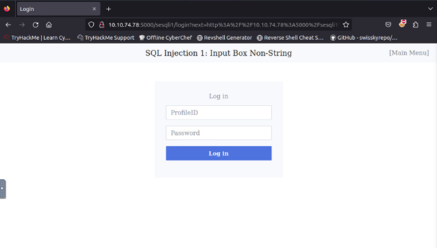
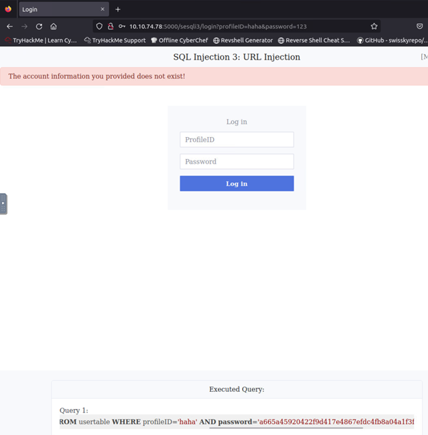
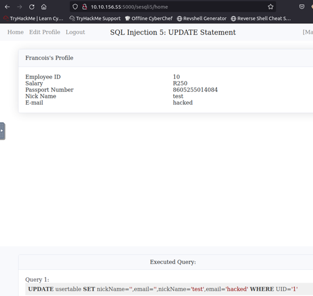
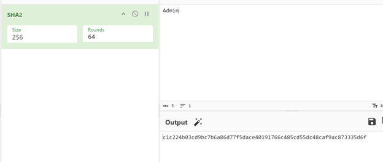

# **Lý Thuyết**

**Theo lý thuyết, SQL Injection** là một kỹ thuật lợi dụng những lỗ hổng về câu truy vấn của các ứng dụng. Lỗ hổng tồn tại khi đầu vào của người dùng không được kiểm tra đúng cách, được thực hiện bằng cách chèn thêm một đoạn SQL để làm sai lệnh đi câu truy vấn ban đầu, từ đó có thể khai thác dữ liệu từ database. **SQL injection** có thể cho phép attackers thực hiện các thao tác như một người quản trị web, trên cơ sở dữ liệu của ứng dụng.

Về mặt thực tiễn: Nói đơn giản là do thiết kế của giao diện nhập dữ liệu bất kỳ và sử dụng các đầu vào này để xây dựng các truy vấn SQL, không giới hạn việc người dùng nhập những gì. Từ đó attacker lợi dụng những lỗi đó để chèn vào đó các đoạn truy vấn SQL rồi gửi lên server để sữa đổi dữ liệu từ database, hoặc lấy thông tin từ database.

Sau đây là 1 bài lab đơn giản bao gồm về những vấn đề như:

-   SQL injection
-   SQL statements: SELECT and UPDATE statements

Và cũng sẽ nói thêm về biện pháp phòng ngừa và bảo vệ/chống lại các tấn công phổ biến(Measures to prevent and protect against popular attack)

# Mục lục

[I. SQL Injection](#sqli)

[1. Input Box Non-String](#sqli1)

[2. Input Box String](#sqli2)

[3. URL](#sqli3)

[II. SQL Statements](#sqls)

[*. Bonus](#sqls1)

[III. Measures to prevent and protect against popular attack](#measures)

# Nội dung lab

## I. SQL Injection

Trong phần này ta sẽ làm việc với giao diện người dùng đăng nhập, ta sẽ sử dụng nhưng câu lệnh cơ bản để có thể đăng nhập vào nhưng không cần biết mật khẩu hay tài khoản của người dùng.

### 1. Input Box Non-String

Đầu tiên, ta sẽ có 1 giao diện người dùng đơn giản như sau, với vai trò là 1 attacker, ta sẽ thử nhập bất cứ thứ gì để tìm manh mối.

Khi nhập thử vài thứ đơn giản và log in, ta được thông tin trả về là sai thông tin đăng nhập, nhưng đây là môi trường luyện tập/học hỏi nên ta được trả về kèm query của SQL như sau: **SELECT uid, name, profileID, salary, passportNr, email, nickName, password FROM usertable WHERE profileID=haha AND password = 'a665a45920422f9d417e4867efdc4fb8a04a1f3fff1fa07e998e86f7f7a27ae3'**

Khi nhìn vào query, ta thấy được những thứ ta nhập vào sẽ được đặt vào để tìm kiếm, ProfileID sẽ được giữ nguyên, còn Password sẽ bị băm ở 1 dạng nào đó. Từ đây, ta có thể phân tích rằng ta sẽ khai thác được ở chỗ ProfileID do nó giữ nguyên những gì ta nhập vào, còn Password thì không do nó đã bị chuyển đổi khi đưa vào query tìm kiếm của SQL.

Ta bắt đầu sử dụng cú pháp truy vấn SQL đã biết/học để khai thác: **1 or 1=1 --**

Password nhập hay không nhập sẽ tùy vào giao diện bắt buộc hay không, do giao diện này bắt buộc ta nhập vào password và nó sẽ biển đổi ở khúc sau, mà cái ta cần khúc đầu query là đúng và nó sẽ trả về kết quả, nên ở đây ta dùng **“--”** để kết thúc câu truy vấn (có nghĩ là từ sau “--” ở câu truy vấn bên dưới sẽ không được dùng đến để truy vấn mặc dù có hiển thị). Nên khúc password này nhập bất cứ thứ gì cũng được. Và ta sẽ được trả về thông tin cần biết.

**SELECT uid, name, profileID, salary, passportNr, email, nickName, password FROM usertable WHERE profileID= 1 or 1=1 -- AND password = 'a665a45920422f9d417e4867efdc4fb8a04a1f3fff1fa07e998e86f7f7a27ae3'**

### 2. Input Box String

Cũng như ban đầu, ta có 1 giao diện người dùng đơn giản, cùng với những bước thử đơn giản để biết được cần làm những gì.

Khi thử xong ta được trả về với câu truy vấn như sau: **SELECT uid, name, profileID, salary, passportNr, email, nickName, password FROM usertable WHERE profileID = 'haha' AND password = 'a82bbcafa60653297ec19c20da291c70a861098afd5fb2b2325a947272379f57'**

Điều khác biệt so với cái ở trên là ở đây ta thấy chữ ta nhập vào được bỏ trong dấu ‘, có nghĩa là định dạng nhập vào sẽ là string, còn password vẫn là như cũ sẽ được băm ra

Ta cũng bắt đầu sử dụng cú pháp truy vấn SQL đã biết/học để khai thác: **1 or 1=1 --**, nhưng lần này khác hơn định dạng đầu vào sẽ giữ nguyên là chuỗi string đó, và ta sẽ cần thay đổi câu truy vấn 1 tý để dừng và bắt đầu chuỗi string ở những điểm ta muốn, nên cú pháp là: **1' or '1'='1' --**

Khúc sau, password vẫn như trên, nên ta nhập gì cũng được.

2 dấu **' màu xanh** là mặc định của SQL, ta điều chỉnh sau số 1 của ta là 1 dấu **'** để kết thúc dấu **'** mặc định của SQL, còn dấu **'** còn lại sau -- coi như không có tác dụng

**SELECT uid, name, profileID, salary, passportNr, email, nickName, password FROM usertable WHERE profileID = '1' or '1'='1' --' AND password = 'cfae26288bd82e1a97669b7720470cf394e87b0e53bdd7e584055805cc63001f'**

### 3. URL

Cũng như 2 phần trước, là 1 giao diện người dùng, ta thực hiện các bước như trước, và được trả về kết quả y như cái thứ 2 chúng ta đã là

Khi thực hiện với cú pháp truy vấn y chang như cái 2: **1' or '1'='1' --**, ta được trả về là trang đã cấm nhập các cú pháp đặc biệt, nhưng khi nhìn lên url, ta thấy được các thứ ta nhập đều được ghi trên đó

Ta thử sửa đổi url trên thành như sau và enter:

**http://10.10.74.78:5000/sesqli3/login?profileID=1' or '1'='1' --&password=123**

Ta đã đăng nhập thành công và lấy được thông tin

## II. SQL statements

Phần này sẽ chuyên sâu hơn về việc lấy, thay đổi dữ liệu người dùng và gần như chỉ áp dụng được khi đã thực hiện được bước SQL injection trên.

Lần này đề bài cho ta tài khoản và mật khẩu sẵn, mục tiêu là vào hệ thống với các thủ thuật cần thiết như(thay đổi, cập nhật cần) để tìm ra flag

-   **profileID: 10**
-   **password: toor**

Đầu tiên, ta nhập tài khoản và mật khẩu đã có để vào bên trong.

Khi đã vào được, kiểm tra các chỗ có thể triển tấn công, ta chỉ thấy được mục “Edit Profile” là có khả năng tấn công.

Thử nhập “Nick Name” đại thử coi query là gì, ta được

Thấy được khả năng tấn công, ta bắt đầu thử câu truy vấn như sau: **',nickName='test',email='hacked** để thử coi có thay đổi gì hơn không.

Chỉ khác ở chỗ đặt câu truy vấn ở “Nick Name” hay “E-Mail” thì sẽ đổi hay có được thông tin ở vị trí mong muốn.

Sau khi xác định là có thể khai thác, ta dùng câu truy vấn sau: **',nickName=(SELECT group_concat(tbl_name) FROM sqlite_master),email='** để coi có thông tin khác từ table khác userdata không.

Kết quả ta tìm được thêm 1 table là: secrets

\*Khúc này sẽ có thêm 1 cái nữa về cập nhật/thay đổi thông tin người dùng, sẽ để nó dưới phần Bonus(sau khi đã tìm ra flag)

Tiếp theo ta thử gọi table secrets ra thử coi, table đó chứa những gì với câu truy vấn sau: **',nickName=(SELECT sql FROM sqlite_master WHERE name ='secrets'),email='**

Khi đã biết trong bảng đó chứa những gì, ta dùng câu truy vấn: **',nickName=(SELECT group_concat(id \|\| "," \|\| author \|\| "," \|\| secret \|\| ":") from secrets),email='** để hiện ra nó ẩn giấu gì trong đó

Và phát hiện ra cái cần kiếm **THM{b3a540515dbd9847c29cffa1bef1edfb}**

### \*Bonus

Vào lúc ta tìm ra chỉ có 2 table là: userdata và secrets.

Thì ở khúc trên ta đã tìm ra flag ở secrets, còn userdata, ta cùng ngó qua thử để coi trong table đó chứa những gì với câu truy vấn sau: **',nickName=(SELECT sql FROM sqlite_master WHERE name ='usertable'),email='**

Thấy được việc table userdata này có chứa những thông tin cần thiết để đăng nhập như: id, password, name. Ta dùng câu truy vấn sau để hiện những thông tin đó ra: **',nickName=(SELECT group_concat(profileID \|\|  "," \|\| name \|\| "," \|\| password \|\| ":") from usertable),email='**

Có thêm name để biết user đó là ai có gì đặc biệt vì trong đây **user id** theo số thứ tự từ **10** nhưng có một user nhảy phát lên **99.** Ta thấy được user đặc biệt này là admin. Nên ta quyết định thử thay đổi mật khẩu của admin này thử.

Vì đây là môi trường thử nghiệm/học tập, nên các table này thường được hash ra bằng **SHA2 với size/round là 256/64**, ta dùng 1 trang web tool để chuyển 1 đoạn pass ta mong muốn thay đổi thành mã hash của nó. Rồi dùng đoạn mã hash vừa có cập nhật lại pass của admin.

Sau khi đã có đoạn mã hash, ta tiến hành dùng câu truy vấn như sau để cập nhật pass cho admin:

**', password='c1c224b03cd9bc7b6a86d77f5dace40191766c485cd55dc48caf9ac873335d6f' WHERE name='Admin'-- -**

Sau khi đã cập nhật xong ta lại dùng câu truy vấn để hiển thị lại thông tin table đó: **',nickName=(SELECT group_concat(profileID \|\|  "," \|\| name \|\| "," \|\| password \|\| ":") from usertable),email='** ta thấy được pass của admin đã thay đổi thành đoạn mã hash ta ghi ở trên.

Thoát user hiện tại và đăng nhập vào admin thử với mật khẩu đã biết. Và kết quả ta đã vào được profile của admin

## III. Measures to prevent and protect against popular attack

**Sử dụng Web Application Firewalls (WAF):** có các rule chống syntax đã quy định trước, Load Balance, chống top 10 owsap,…

**Kiểm tra và ràng buộc đầu vào (Input Validation and Sanitization)**: gần giống như WAF, nhưng WAF làm được nhiều chức năng hơn, hoặc nếu chỉ cần chống SQL với kiểm tra ràng buộc này thì không cần đầu tư thêm chi phí vào WAF.

**Sử dụng Prepared Statements:**

Sẽ gồm 2 bước là *Prepare* và *Compile and Execute*

*Prepare*: đầu tiên, ứng dụng tạo ra 1 statement template và gửi nó cho DB. Các giá trị không được chỉ ra và được gọi là parameters (dấu ? bên dưới) **SELECT \* FROM accounts WHERE id = ?;**

*Compile and Execute:* (parse, optimizes và translates) statement template , store kết quả mà không thực thi. Quá trình này do DB thực hiện. Ứng dụng gửi giá trị của parametes của statement template và DB thực thi nó. Có thể thực thi statement nhiều lần với nhiều giá trị khác nhau.
